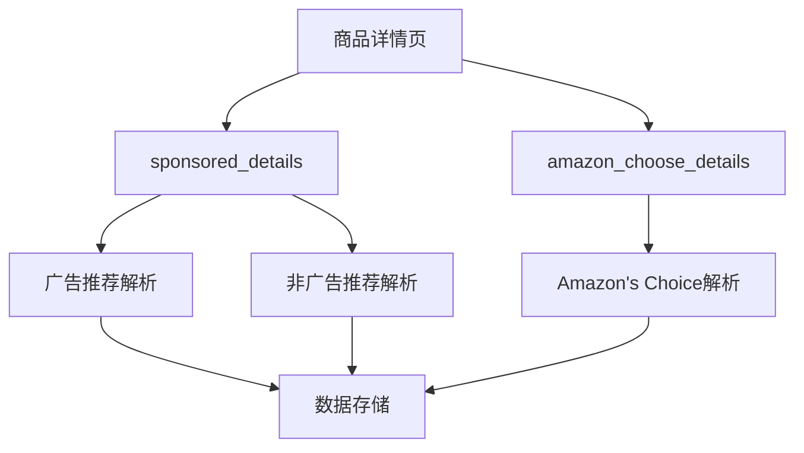

好的,让我详细解释这个 `amazon_association_details.py` 的代码:

### 1. 核心功能
这是一个用于抓取亚马逊商品关联数据的爬虫,主要抓取商品详情页中的:
- 相关推荐商品
- 赞助商品
- "经常一起购买"的商品
- 亚马逊精选商品等

### 2. 主要组件解析

#### 2.1 异步请求函数
```python
async def _async_crawl_data(url, method='GET', data=None, headers=None, cookies=None, proxies=None):
```
- 负责发送HTTP请求
- 包含5次重试机制
- 支持代理设置
- 使用 aiohttp 进行异步请求

#### 2.2 数据存储函数
```python
async def process_item(data):
```
- 将解析后的数据通过API发送到服务器
- 发送到端点: `http://47.113.178.75:8000/Amazon/save_association_details`

#### 2.3 三个主要解析函数

1. 赞助商品解析:
```python
async def sponsored_parse(response, data):
```
- 解析赞助商品数据
- 提取商品信息如标题、价格、评分等

2. 普通关联商品解析:
```python
async def details_parse(response, data):
```
- 解析页面中的相关推荐商品
- 处理商品轮播数据

3. 亚马逊精选解析:
```python
async def amazon_choose_details(response, data):
```
- 专门处理亚马逊精选商品数据
- 包含特殊的请求参数处理

#### 2.4 多线程异步爬取
```python
def threaded_async_crawler():
```
- 创建异步事件循环
- 从Redis获取任务
- 启动异步爬取任务

### 3. 数据处理流程

1. **任务获取**:
   - 从Redis队列获取ASIN码
   - Redis键名格式: `association_details_时间戳_0`

2. **请求处理**:
   - 访问商品详情页
   - 处理反爬验证
   - 支持代理使用

3. **数据解析**:
   - 提取商品基本信息
   - 解析相关商品数据
   - 处理评分和价格等数值数据

4. **数据存储**:
   - 格式化数据
   - 通过API保存

### 4. 技术特点

1. **异步并发**:
   - 使用 `asyncio` 和 `aiohttp` 实现异步请求
   - 提高爬取效率

2. **多线程处理**:
   - 默认开启2个线程
   - 可通过 `num_threads` 调整

3. **错误处理**:
   - 包含重试机制
   - 异常日志记录

4. **数据队列**:
   - 使用Redis作为任务队列
   - 支持分布式部署

### 5. 配置项

```python
redis_name = "association_details_1717050521_0"  # Redis键名
proxies = 'http://127.0.0.1:7890'  # 代理设置
num_threads = 2  # 线程数
```

### 6. 使用场景

这个爬虫主要用于:
1. 分析商品关联关系
2. 研究亚马逊推荐算法
3. 跟踪竞品营销策略
4. 收集商品营销数据

这是一个功能完整的异步爬虫,采用了现代化的异步编程技术,适合大规模的商品数据采集工作。


### 数据流转图


