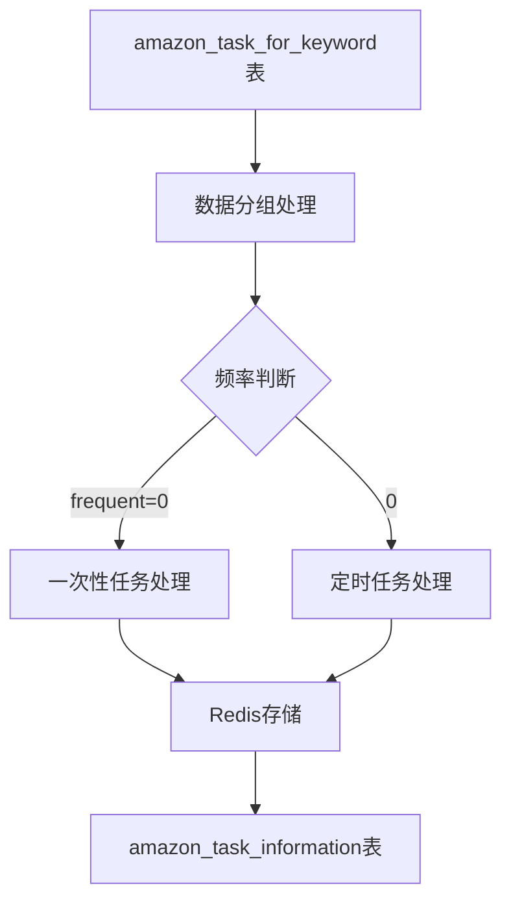

负责任务生成和分发

让我详细解析`amazon_task_process.py`这个任务处理文件的主要功能：

### 1. 核心功能
这个文件主要负责将`amazon_task_for_keyword`表中的数据处理后存入`amazon_task_information`表，供采集端使用。

### 2. 主要函数分析

1. **数据库插入操作**
```python
def insert_mysql(query, data):
    """执行参数化SQL插入"""
    with pool.connection() as conn:
        with conn.cursor() as cursor:
            try:
                cursor.execute(query, data)
                conn.commit()
                logger.info("Database insert operation successful!")
            except Exception as e:
                conn.rollback()
                logger.error(f"Error performing database insert operation: {str(e)}")
```

2. **数据处理函数**
```python
def data_process(crawl_object, result_list):
    """
    处理不同类型的爬虫任务
    
    参数:
    - crawl_object: 爬虫类型(category/product_details等)
    - result_list: 待处理的任务列表
    """
    # 获取当前时间
    current_time = datetime.now()
    formatted_time = current_time.strftime('%Y-%m-%d %H:%M:%S')
    
    # 按频率分组处理数据
    result_list.sort(key=lambda x: x['frequent'])
    grouped_data = {key: list(group) for key, group in groupby(result_list, key=lambda x: x['frequent'])}
```

3. **任务频率处理**
```python
# 处理不同频率的任务
if frequent == 0:
    # 一次性任务处理
    set_name = crawl_object + "_" + str(int(time.time())) + f'_{frequent}'
    
elif 0 < frequent < 7:
    # 定时任务处理
    for i in range(4, 24 // frequent):
        set_name = crawl_object + "_" + str(int(time.time())) + f'_{frequent}_{i}'
```

### 3. 任务类型处理

1. **Category类型任务**
```python
if crawl_object == "category":
    # 查询分类信息
    sql_query = """
        SELECT 
            acl.category_id,
            acl.category_name,
            acl.marketplace_id,
            acl.list_type,
            acl.url,
            atk.ds
        FROM 
            amazon_task_for_keyword atk
        JOIN 
            amazon_category_list_info acl 
        ON 
            atk.keyword = acl.category_id 
            AND atk.market_place_code = acl.marketplace_id
        WHERE 
            atk.crawl_object = 'category';
    """
```

2. **Product Details类型任务**
```python
elif crawl_object == "product_details":
    elements = [json.dumps({
        "keyword": value["keyword"].upper(), 
        "market_place_code": value["market_place_code"],
        "ds": value["ds"], 
        "frequent": "day", 
        "data_hour": "0"
    }) for value in items]
```

### 4. 数据存储结构

1. **Redis存储**
```python
# Redis配置
REDIS_CONFIG = {
    'host': '47.119.114.27',
    'port': 6379,
    "password": "WhdE@2023",
    'db': 1
}
r = redis.Redis(**REDIS_CONFIG)
```

2. **MySQL连接池**
```python
# MySQL连接池配置
pool = PooledDB(pymysql, 4, 
    host="47.119.114.27", 
    user='root', 
    passwd='Daer20231213!', 
    db='amazon', 
    port=3306
)
```

### 5. 定时任务

```python
# 定时任务设置
schedule.every(1).minute.do(run_check_status)  # 每分钟检查状态
schedule.every().day.at("03:00").do(run_task_storage)  # 每天凌晨3点存储任务
```

### 6. 状态检查功能

```python
def run_check_status():
    """检查任务状态并处理失败任务"""
    # 查询进行中的任务
    query = "SELECT * FROM amazon_task_information WHERE task_status = 'In Progress';"
    
    # 检查Redis中任务是否存在
    if r.exists(result_dict["task_source"]):
        print(f"存在表单 {result_dict['task_source']}")
    else:
        # 更新任务状态为完成
        bestsellers_sql = f"UPDATE amazon_task_information SET task_status = 'Completed'..."
```

### 7. 错误处理和日志记录

```python
# 日志配置
logger = logging.getLogger(__name__)
logger.setLevel(logging.INFO)
log_file = "task_process_logs.log"
max_size = 500 * 1024 * 1024  # 500MB
handler = RotatingFileHandler(log_file, maxBytes=max_size, backupCount=1)
```


让我详细解释这个数据处理的逻辑流程：

### 1. 数据处理主函数 `data_process(crawl_object, result_list)`

```python
def data_process(crawl_object, result_list):
    # 1. 获取当前时间
    current_time = datetime.now()
    formatted_time = current_time.strftime('%Y-%m-%d %H:%M:%S')
    
    # 2. 按频率分组
    result_list.sort(key=lambda x: x['frequent'])  # 先排序
    grouped_data = {key: list(group) for key, group in groupby(result_list, key=lambda x: x['frequent'])}
```

### 2. 按频率处理数据

1. **一次性任务 (frequent = 0)**
```python
if frequent == 0:
    # 生成任务ID
    set_name = crawl_object + "_" + str(int(time.time())) + f'_{frequent}'
    
    # 根据不同爬虫类型处理
    if crawl_object == "category":
        # 处理分类任务
        # 从数据库获取分类信息并存入Redis
    elif crawl_object == "product_details":
        # 处理商品详情任务
        elements = [json.dumps({
            "keyword": value["keyword"].upper(),
            "market_place_code": value["market_place_code"],
            "ds": value["ds"],
            "frequent": "day",
            "data_hour": "0"
        }) for value in items]
        r.sadd(set_name, *elements)
```

2. **定时任务 (0 < frequent < 7)**
```python
elif 0 < frequent < 7:
    # 按小时分配任务
    for i in range(4, 24 // frequent):
        # 生成带时间的任务ID
        set_name = crawl_object + "_" + str(int(time.time())) + f'_{frequent}_{i}'
        
        # 创建任务数据
        elements = [json.dumps({
            "keyword": value["keyword"],
            "market_place_code": value["market_place_code"],
            "ds": value["ds"],
            "frequent": "hour",
            "data_hour": str(i)
        }) for value in items]
        
        # 存入Redis
        r.sadd(set_name, *elements)
        
        # 计算任务执行时间
        task_time = (start_time + timedelta(hours=i * frequent))
```

### 3. 数据流转过程



### 4. 任务状态流转

```python
# 任务状态记录
data = {
    'task_id': set_name,
    'task_type': crawl_object,
    'create_at': formatted_time,
    'task_source': set_name,
    'task_start_time': task_time,
    'priority': '1',
    'task_status': 'Pending'  # 初始状态为Pending
}

# 插入任务信息
task_sql = """
INSERT INTO amazon_task_information 
    (task_id, task_type, create_at, task_source, 
     task_start_time, priority, task_status) 
VALUES 
    (%(task_id)s, %(task_type)s, %(create_at)s, 
     %(task_source)s, %(task_start_time)s, 
     %(priority)s, %(task_status)s)
"""
```

### 5. 具体示例

假设有一个商品详情任务：
```python
# 输入数据
task = {
    "keyword": "B07ZPKN6YR",
    "market_place_code": "US",
    "frequent": 4,  # 每4小时执行一次
    "ds": "20240321"
}

# 处理后在Redis中生成多个任务集合
# 例如：product_details_1711001234_4_4  (4点执行)
# 例如：product_details_1711001234_4_8  (8点执行)
# 例如：product_details_1711001234_4_12 (12点执行)
# ...
```

### 6. 关键点说明

1. **任务命名规则**
```python
set_name = f"{crawl_object}_{timestamp}_{frequent}_{hour}"
# 例如：product_details_1711001234_4_8
# - product_details: 爬虫类型
# - 1711001234: 时间戳
# - 4: 频率
# - 8: 执行小时
```

2. **频率控制**
- frequent = 0: 一次性任务
- 0 < frequent < 7: 定时任务，按小时执行
- frequent > 12: 不处理

3. **数据存储**
- Redis: 存储任务详情
- MySQL: 存储任务状态和配置

这样的设计可以实现灵活的任务调度和执行，同时保证了数据的可追踪性和任务的可管理性。
