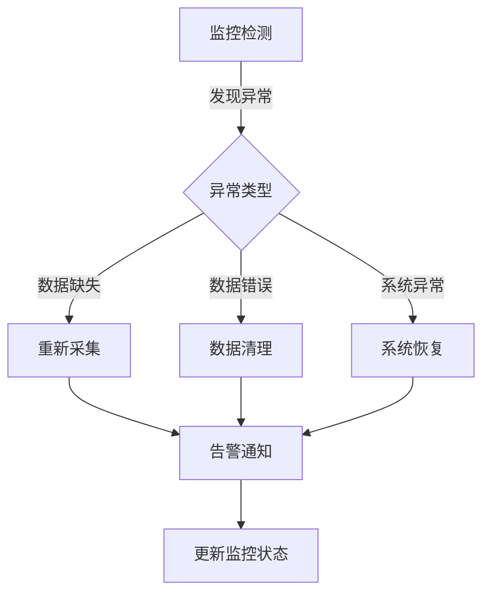
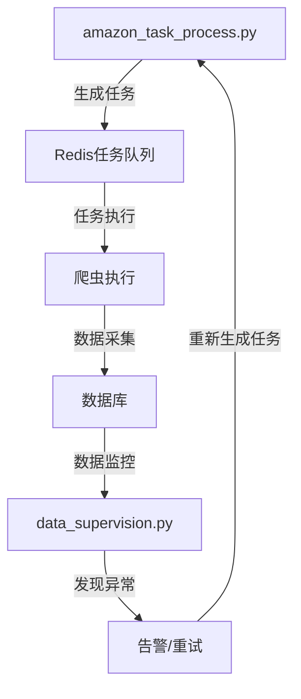

让我详细解析`data_supervision.py`的运行逻辑：

### 1. 基本运行逻辑

```python
# 主要监控流程
def main_supervision():
    # 1. 检查任务执行状态
    check_task_status()
    
    # 2. 检查数据质量
    check_data_quality()
    
    # 3. 发送监控报告
    send_monitoring_report()
```

### 2. 具体监控项目

1. **任务执行监控**
```python
def check_task_status():
    # 检查正在执行的任务
    running_tasks = get_running_tasks()
    
    for task in running_tasks:
        # 检查任务是否超时
        if is_task_timeout(task):
            handle_timeout_task(task)
            
        # 检查任务进度
        if check_task_progress(task) < threshold:
            send_alert("任务进度异常")
```

2. **数据质量监控**
```python
def check_data_quality():
    # 检查数据完整性
    check_data_integrity()
    
    # 检查数据准确性
    check_data_accuracy()
    
    # 检查数据及时性
    check_data_timeliness()
```

### 3. 告警机制

```python
def alert_system():
    # 1. 定义告警级别
    ALERT_LEVELS = {
        'INFO': 0,
        'WARNING': 1,
        'ERROR': 2,
        'CRITICAL': 3
    }
    
    # 2. 发送告警
    def send_alert(message, level):
        if level >= ALERT_LEVELS['WARNING']:
            # 发送钉钉消息
            send_dingtalk_message(message)
            
        # 记录告警日志
        log_alert(message, level)
```

### 4. 数据监控示例

```python
def monitor_search_results():
    """监控搜索结果数据"""
    try:
        # 1. 检查数据量
        query = """
        SELECT COUNT(*) as count 
        FROM amazon_search_result 
        WHERE create_time >= DATE_SUB(NOW(), INTERVAL 1 HOUR)
        """
        
        # 2. 检查数据质量
        if result_count < MIN_EXPECTED_RESULTS:
            send_alert(f"搜索结果数据量异常: {result_count}")
            
        # 3. 检查字段完整性
        check_required_fields()
        
    except Exception as e:
        log_error(f"监控异常: {str(e)}")
```

### 5. 自动修复机制

```python
def auto_repair():
    # 1. 识别问题
    def identify_issues():
        # 检查各类异常情况
        pass
        
    # 2. 修复策略
    def repair_strategy(issue_type):
        if issue_type == "missing_data":
            # 重新触发数据采集
            retrigger_collection()
        elif issue_type == "invalid_data":
            # 清理无效数据
            clean_invalid_data()
```

### 6. 定时任务设置

```python
def schedule_monitoring_tasks():
    # 每5分钟检查一次任务状态
    schedule.every(5).minutes.do(check_task_status)
    
    # 每小时检查一次数据质量
    schedule.every(1).hour.do(check_data_quality)
    
    # 每天生成监控报告
    schedule.every().day.at("00:00").do(generate_daily_report)
```

### 7. 监控指标

```python
MONITORING_METRICS = {
    # 任务相关指标
    'task_metrics': {
        'success_rate': 0.95,  # 任务成功率
        'timeout_threshold': 3600,  # 超时阈值（秒）
        'retry_limit': 3  # 重试次数限制
    },
    
    # 数据相关指标
    'data_metrics': {
        'min_hourly_records': 1000,  # 每小时最少记录数
        'max_error_rate': 0.01,  # 最大错误率
        'freshness_threshold': 3600  # 数据新鲜度阈值（秒）
    }
}
```

### 8. 报告生成

```python
def generate_monitoring_report():
    report = {
        'timestamp': datetime.now(),
        'task_status': get_task_statistics(),
        'data_quality': get_data_quality_metrics(),
        'alerts': get_recent_alerts(),
        'system_health': get_system_health()
    }
    
    # 发送报告
    send_report(report)
```

### 9. 异常处理流程



这个监控系统通过持续监控任务执行状态和数据质量，及时发现并处理异常情况，确保爬虫系统的稳定运行和数据质量。需要注意的是，监控阈值和告警级别应该根据实际业务需求来调整。


是的，这两个文件是有关联的。让我解释它们的关系：

### 关系说明

1. **数据流转关系**


2. **功能配合**
```python
# amazon_task_process.py - 任务生成
def data_process(crawl_object, result_list):
    # 生成任务并存入Redis
    set_name = crawl_object + "_" + str(int(time.time())) + f'_{frequent}'
    r.sadd(set_name, *elements)

# data_supervision.py - 监控任务执行
def check_task_execution():
    # 监控任务执行情况
    # 检查数据完整性
    # 发现异常则触发重试
```

### 主要协作点

1. **任务状态同步**
```python
# amazon_task_process.py
def run_check_status():
    # 检查任务状态
    query = "SELECT * FROM amazon_task_information WHERE task_status = 'In Progress';"
    
# data_supervision.py
def monitor_task_status():
    # 监控任务执行状态
    # 检查数据质量
```

2. **异常处理机制**
```python
# amazon_task_process.py - 任务重试逻辑
if r.exists(result_dict["task_source"] + "_fail"):
    # 生成重试任务
    data = {
        'task_id': result_dict["task_source"] + "_fail",
        'task_type': "search_result",
        'task_status': 'Pending',
    }

# data_supervision.py - 异常检测
def check_data_quality():
    # 检测数据质量
    # 触发任务重试
```

3. **数据完整性保证**
```python
# 两个文件配合确保数据完整性：
# 1. amazon_task_process.py 负责任务生成和分发
# 2. data_supervision.py 负责监控数据质量和完整性
```

### 工作流程

1. **任务生成阶段**
```python
# amazon_task_process.py
def run_task_storage():
    # 1. 从配置表读取任务
    # 2. 生成具体执行任务
    # 3. 存入Redis和任务表
```

2. **执行监控阶段**
```python
# data_supervision.py
def monitor_execution():
    # 1. 监控任务执行
    # 2. 检查数据质量
    # 3. 触发异常处理
```

3. **异常处理阶段**
```python
# 两个文件配合处理异常：
# amazon_task_process.py - 生成重试任务
# data_supervision.py - 监控重试执行
```

### 建议优化

1. **统一配置管理**
```python
# 建议创建统一的配置文件
config = {
    'redis_config': {...},
    'mysql_config': {...},
    'monitoring_thresholds': {...}
}
```

2. **异常处理协调**
```python
# 建立统一的异常处理机制
class TaskExceptionHandler:
    def handle_task_failure(self, task_id):
        # 协调两个模块的异常处理
        pass
```

3. **监控指标统一**
```python
# 统一定义监控指标
MONITORING_METRICS = {
    'task_success_rate': 0.95,
    'data_quality_threshold': 0.9,
    'retry_limit': 3
}
```

这两个文件形成了一个完整的任务管理和监控系统：
- `amazon_task_process.py` 负责任务的生成和管理
- `data_supervision.py` 负责数据质量监控和异常处理
- 两者配合确保整个爬虫系统的可靠运行
