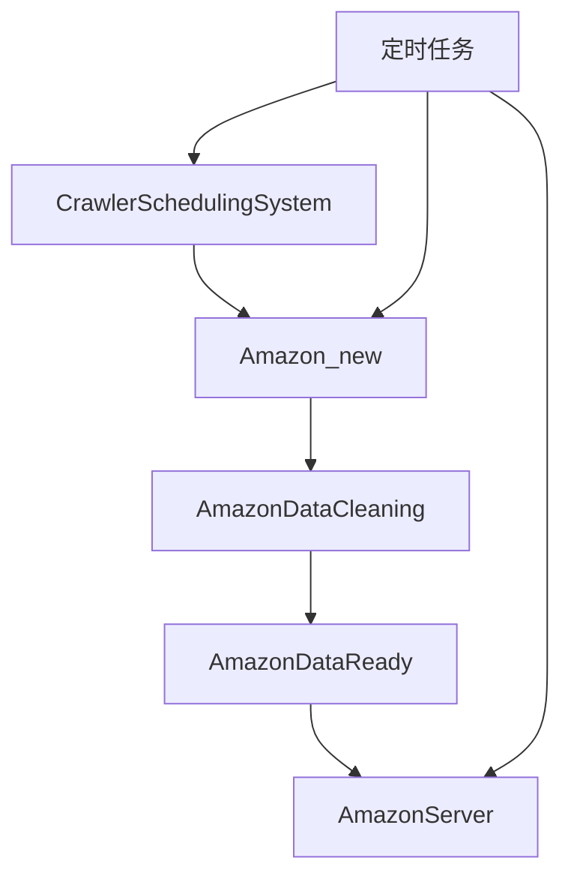

根据提供的代码结构，这是一个亚马逊数据抓取和处理的项目，主要包含以下几个主要模块：

- Amazon_new: 核心爬虫模块

- 包含多个爬虫实现(商品详情、评论、搜索结果等)

- 实现了异步爬取和多线程调度

- 包含代理IP管理和请求头管理

- AmazonDataCleaning: 数据清洗模块

- 处理主从ASIN关系

- 清洗商品详情数据

- 清洗评论数据

- AmazonDataReady: 数据准备模块

- 分类数据导入MySQL

- Redis数据导出

- 搜索关键词准备

- AmazonServer: API服务模块

- FastAPI实现的REST API

- 数据监控和告警

- 汇率信息服务

- CrawlerSchedulingSystem: 爬虫调度系统

- 任务分发和管理

- Cookie管理

- 结果处理

- 定时任务: 定时任务模块

- Cookie定时更新

- 数据定时清理

- IP代理定时更新

- 汇率定时更新

主要特点：

- 采用异步+多线程的方式提高爬取效率

- 实现了完整的数据处理链路(采集->清洗->存储->服务)

- 包含监控告警等运维特性

- 支持多站点、多语言

- 有完整的数据库表结构设计

这是一个比较完整的数据采集和处理系统，涵盖了从数据获取到最终应用的各个环节。

我来帮您按照数据流向和依赖关系梳理这些模块，并创建一个清晰的README.md文件：
# Amazon数据采集与处理系统

## 系统架构

### 1. CrawlerSchedulingSystem（爬虫调度系统）
核心调度中心，负责：
- 任务分发与调度管理
- Cookie池管理
- 代理IP池管理
- 任务优先级控制
- 爬虫任务状态监控

### 2. Amazon_new（数据采集模块）
主要爬虫实现，负责：
- 商品详情数据采集
- 评论数据采集
- 搜索结果采集
- 店铺数据采集
- 异步请求处理
- 反爬处理
包含：
- amazon_reviews.py: 评论数据采集
- amazon_product_details.py: 商品详情采集
- amazon_merchant_details.py: 商家信息采集
- amazon_search_product.py: 搜索结果采集
- amazon_association_details.py: 关联商品采集

### 3. AmazonDataCleaning（数据清洗模块）
数据预处理与清洗，负责：
- 原始数据格式标准化
- 数据去重与校验
- 主从ASIN关系处理
- 评论数据清洗
- 商品属性数据提取
- 异常数据处理

### 4. AmazonDataReady（数据准备模块）
数据加工与存储，负责：
- MySQL数据导入导出
- Redis缓存管理
- 搜索关键词管理
- 数据分类与标签化
- 数据统计分析

### 5. AmazonServer（API服务模块）
对外服务接口，负责：
- 数据入库服务
- 任务状态管理
- 数据质量监控
- 告警服务
提供数据服务接口：
- amazon_api.py: RESTful API实现
- amazon_task_process.py: 任务处理逻辑
- data_supervision.py: 数据监控服务

### 6. 定时任务（系统维护模块）
系统运维保障，负责：
- Cookie定时更新
- 代理IP定时检测与更新
- 数据定时清理
- 汇率定时更新
- 系统状态定时检查
系统调度中心：
- amazon_task_process.py: 任务分发与处理
- 定时数据采集任务
- Cookie更新
- 数据监控任务
## 数据流转流程

1. 任务创建与分发: 定时任务/amazon_task_process.py
2. 数据采集: amaozn_new中各个文件
3. 数据处理和存储: amazonserver/amazon_api.py

## 模块依赖关系

- CrawlerSchedulingSystem：系统入口，调度其他模块
- Amazon_new：依赖CrawlerSchedulingSystem提供的配置
- AmazonDataCleaning：依赖Amazon_new的原始数据
- AmazonDataReady：依赖AmazonDataCleaning的清洗数据
- AmazonServer：依赖AmazonDataReady的处理数据
- 定时任务：独立模块，为其他模块提供支持

## 关键特性

1. 分布式架构设计
2. 高并发数据采集
3. 实时数据处理
4. 多站点支持
5. 完整的监控告警
6. 灵活的配置管理
7. 稳定的容错机制

## 技术栈
- Python 3.x
- MySQL
- Redis
- FastAPI
- Celery
- aiohttp
- SQLAlchemy

